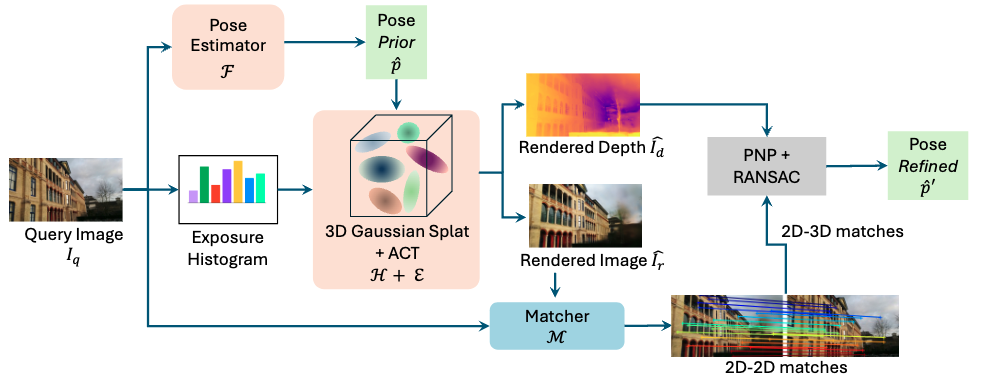

# GS-CPR: Efficient Camera Pose Refinement via 3D Gaussian Splatting
**[Changkun Liu](https://lck666666.github.io/),
[Shuai Chen](https://scholar.google.com/citations?user=c0xTh_YAAAAJ&hl=en), 
[Yash Bhalgat](https://scholar.google.com/citations?user=q0VSEHYAAAAJ&hl=en),
[Siyan Hu](https://scholar.google.com/citations?user=S56rLU4AAAAJ&hl=en), 
[Ming Cheng](https://scholar.google.com/citations?user=MPyUxv4AAAAJ&hl=en),
[Zirui Wang](https://scholar.google.com/citations?user=zCBKqa8AAAAJ&hl=en), 
[Victor Prisacariu](https://scholar.google.com/citations?user=GmWA-LoAAAAJ&hl=en) 
and [Tristan BRAUD](https://scholar.google.com/citations?user=ZOZtoQUAAAAJ&hl=en)**

**International Conference on Learning Representations (ICLR) 2025**

**[Project Page](https://xrim-lab.github.io/GS-CPR/) | [Paper](https://openreview.net/forum?id=mP7uV59iJM)**

[](https://arxiv.org/abs/2408.11085)
[](https://arxiv.org/abs/2408.11085)

## Installation
### ACT Scaffold-GS environment
We tested our code based on CUDA 12.1, PyTorch 2.4.1, and Python 3.11+

### GS-CPR refinement environment
Create the environment as same as [MASt3R](https://github.com/naver/mast3r#demo)

## Datasets
This paper uses three public datasets:
- [Microsoft 7-Scenes](https://www.microsoft.com/en-us/research/project/rgb-d-dataset-7-scenes/)
- [Cambridge Landmarks](https://www.repository.cam.ac.uk/handle/1810/251342/)
- [Stanford 12-Scenes](https://graphics.stanford.edu/projects/reloc/)

Following [ACE](https://github.com/nianticlabs/ace), we utilize the same scripts in the `datasets` folder to automatically download and extract the data in a consistent format.

> **Important: make sure you have checked the license terms of each dataset before using it.**

### {7, 12}-Scenes:

You can use the `datasets/setup_{7,12}scenes.py` scripts to download the data.
As mentioned in our paper, we experimented _Pseudo Ground Truth (PGT)_ camera poses obtained after running SfM on the scenes (see the [ICCV 2021 paper](https://openaccess.thecvf.com/content/ICCV2021/html/Brachmann_On_the_Limits_of_Pseudo_Ground_Truth_in_Visual_Camera_ICCV_2021_paper.html),
and [associated code](https://github.com/tsattler/visloc_pseudo_gt_limitations/) for details).

To download and prepare the datasets using the PGT poses:

```shell
cd datasets
# Downloads the data to datasets/pgt_7scenes_{chess, fire, ...}
./setup_7scenes.py --poses pgt
# Downloads the data to datasets/pgt_12scenes_{apt1_kitchen, ...}
./setup_12scenes.py --poses pgt
``` 

### Cambridge Landmarks

Simply run:

```shell
cd datasets
# Downloads the data to datasets/Cambridge_{GreatCourt, KingsCollege, ...}
./setup_cambridge.py
```